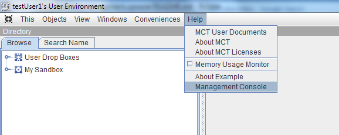
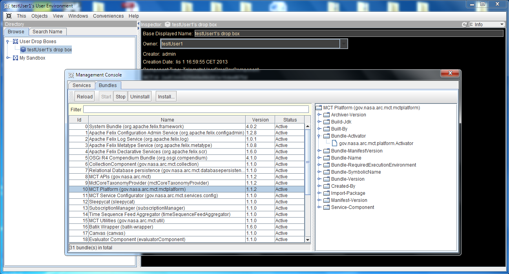
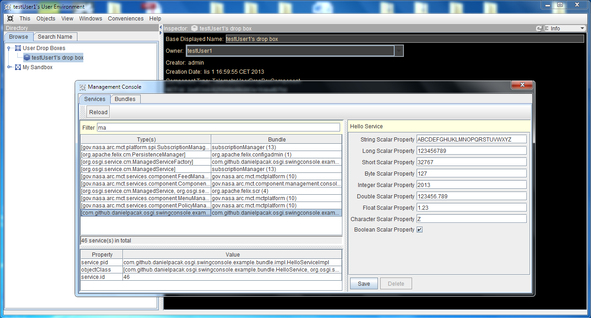
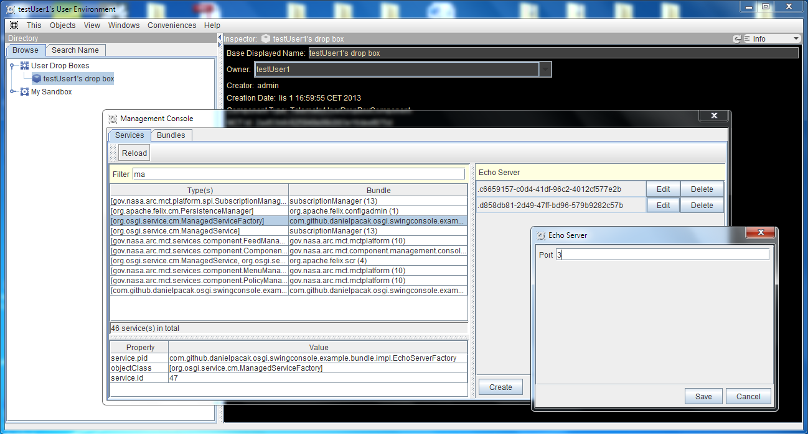

# Management Console Component

Management Console is a simple tool to inspect and manage your MCT instance.

* [Getting Started](#getting-started)
* [Maven Artifacts](#maven-artifacts)

## Getting Started

Management Console is started from the *Help* menu.

By default, Management Console opens with the *Bundles* tab selected, displaying a list of
bundles comprising the MCT instance.

From the *Bundles* tab:
* You can view installed bundles.
* You can start/stop/uninstall a bundle by selecting it, and clicking
  the *Start/Stop/Uninstall* button in the tool bar.
* You can install a new bundle by clicking the *Install...* button
  in the tool bar and selecting the bundle's location.

From the *Services* tab:
* You can inspect services registered by active bundles, i.e. view
  registered types, properties, and configurations.
* You can configure managed services, i.e services that implement the
  `org.osgi.service.cm.ManagedService` interface and provide metatype
  information. A service can provide the metatype either by implementing
  the `org.osgi.service.metatype.MetaTypeProvider` interface or through
  a metatype XML descriptor in `OSGI-INF/metatype/metatype.xml`.

## Maven Artifacts

### gov.nasa.arc.mct:mct.component.management.console
This is a MCT component that registers a new action in the MCT main menu
to launch the Management Console. This artifact has a single dependency
on [OSGi Swing Management Console](https://github.com/danielpacak/com.github.danielpacak.osgi.swingconsole),
which provides reusable and extendable Swing-based UI for managing OSGi platforms.